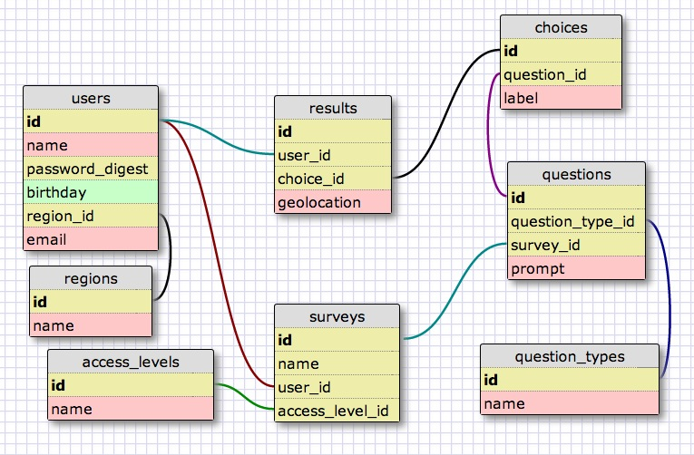

### SCHEMA



### XML
```
<?xml version="1.0" encoding="utf-8" ?>
<!-- SQL XML created by WWW SQL Designer, http://code.google.com/p/wwwsqldesigner/ -->
<!-- Active URL: https://socrates.devbootcamp.com/sql -->
<sql>
<datatypes db="mysql">
  <group label="Numeric" color="rgb(238,238,170)">
    <type label="Integer" length="0" sql="INTEGER" re="INT" quote=""/>
    <type label="Decimal" length="1" sql="DECIMAL" re="DEC" quote=""/>
    <type label="Single precision" length="0" sql="FLOAT" quote=""/>
    <type label="Double precision" length="0" sql="DOUBLE" re="DOUBLE" quote=""/>
  </group>

  <group label="Character" color="rgb(255,200,200)">
    <type label="Char" length="1" sql="CHAR" quote="'"/>
    <type label="Varchar" length="1" sql="VARCHAR" quote="'"/>
    <type label="Text" length="0" sql="MEDIUMTEXT" re="TEXT" quote="'"/>
    <type label="Binary" length="1" sql="BINARY" quote="'"/>
    <type label="Varbinary" length="1" sql="VARBINARY" quote="'"/>
    <type label="BLOB" length="0" sql="BLOB" re="BLOB" quote="'"/>
  </group>

  <group label="Date &amp; Time" color="rgb(200,255,200)">
    <type label="Date" length="0" sql="DATE" quote="'"/>
    <type label="Time" length="0" sql="TIME" quote="'"/>
    <type label="Datetime" length="0" sql="DATETIME" quote="'"/>
    <type label="Year" length="0" sql="YEAR" quote=""/>
    <type label="Timestamp" length="0" sql="TIMESTAMP" quote="'"/>
  </group>

  <group label="Miscellaneous" color="rgb(200,200,255)">
    <type label="ENUM" length="1" sql="ENUM" quote=""/>
    <type label="SET" length="1" sql="SET" quote=""/>
    <type label="Bit" length="0" sql="bit" quote=""/>
  </group>
</datatypes><table x="35" y="223" name="users">
<row name="id" null="1" autoincrement="1">
<datatype>INTEGER</datatype>
<default>NULL</default></row>
<row name="name" null="1" autoincrement="0">
<datatype>MEDIUMTEXT</datatype>
<default>NULL</default></row>
<row name="password" null="1" autoincrement="0">
<datatype>INTEGER</datatype>
<default>NULL</default></row>
<row name="birthday" null="1" autoincrement="0">
<datatype>DATE</datatype>
<default>NULL</default></row>
<row name="region_id" null="1" autoincrement="0">
<datatype>INTEGER</datatype>
<default>NULL</default><relation table="regions" row="id" />
</row>
<row name="email" null="1" autoincrement="0">
<datatype>MEDIUMTEXT</datatype>
<default>NULL</default></row>
<key type="PRIMARY" name="">
<part>id</part>
</key>
</table>
<table x="41" y="382" name="regions">
<row name="id" null="1" autoincrement="1">
<datatype>INTEGER</datatype>
<default>NULL</default></row>
<row name="name" null="1" autoincrement="0">
<datatype>MEDIUMTEXT</datatype>
<default>NULL</default></row>
<key type="PRIMARY" name="">
<part>id</part>
</key>
</table>
<table x="438" y="451" name="question_types">
<row name="id" null="1" autoincrement="1">
<datatype>INTEGER</datatype>
<default>NULL</default></row>
<row name="name" null="1" autoincrement="0">
<datatype>MEDIUMTEXT</datatype>
<default>NULL</default></row>
<key type="PRIMARY" name="">
<part>id</part>
</key>
</table>
<table x="257" y="416" name="surveys">
<row name="id" null="1" autoincrement="1">
<datatype>INTEGER</datatype>
<default>NULL</default></row>
<row name="name" null="1" autoincrement="0">
<datatype>INTEGER</datatype>
<default>NULL</default></row>
<row name="creator_user_id" null="1" autoincrement="0">
<datatype>INTEGER</datatype>
<default>NULL</default><relation table="users" row="id" />
</row>
<row name="access_level_id" null="1" autoincrement="0">
<datatype>INTEGER</datatype>
<default>NULL</default><relation table="access_levels" row="id" />
</row>
<key type="PRIMARY" name="">
<part>id</part>
</key>
</table>
<table x="462" y="290" name="questions">
<row name="id" null="1" autoincrement="1">
<datatype>INTEGER</datatype>
<default>NULL</default></row>
<row name="question_type_id" null="1" autoincrement="0">
<datatype>INTEGER</datatype>
<default>NULL</default><relation table="question_types" row="id" />
</row>
<row name="survey_id" null="1" autoincrement="0">
<datatype>INTEGER</datatype>
<default>NULL</default><relation table="surveys" row="id" />
</row>
<row name="prompt" null="1" autoincrement="0">
<datatype>MEDIUMTEXT</datatype>
<default>NULL</default></row>
<key type="PRIMARY" name="">
<part>id</part>
</key>
</table>
<table x="456" y="161" name="choices">
<row name="id" null="1" autoincrement="1">
<datatype>INTEGER</datatype>
<default>NULL</default></row>
<row name="question_id" null="1" autoincrement="0">
<datatype>INTEGER</datatype>
<default>NULL</default><relation table="questions" row="id" />
</row>
<row name="label" null="1" autoincrement="0">
<datatype>MEDIUMTEXT</datatype>
<default>NULL</default></row>
<key type="PRIMARY" name="">
<part>id</part>
</key>
</table>
<table x="257" y="232" name="results">
<row name="id" null="1" autoincrement="1">
<datatype>INTEGER</datatype>
<default>NULL</default></row>
<row name="user_id" null="1" autoincrement="0">
<datatype>INTEGER</datatype>
<default>NULL</default><relation table="users" row="id" />
</row>
<row name="choice_id" null="1" autoincrement="0">
<datatype>INTEGER</datatype>
<default>NULL</default><relation table="choices" row="id" />
</row>
<row name="geolocation" null="1" autoincrement="0">
<datatype>MEDIUMTEXT</datatype>
<default>NULL</default></row>
<key type="PRIMARY" name="">
<part>id</part>
</key>
</table>
<table x="57" y="456" name="access_levels">
<row name="id" null="1" autoincrement="1">
<datatype>INTEGER</datatype>
<default>NULL</default></row>
<row name="name" null="1" autoincrement="0">
<datatype>MEDIUMTEXT</datatype>
<default>NULL</default></row>
<key type="PRIMARY" name="">
<part>id</part>
</key>
</table>
</sql>


```